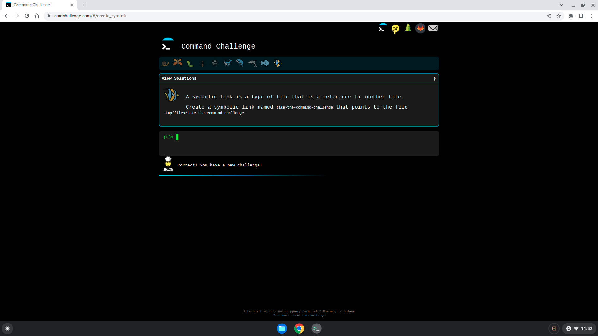
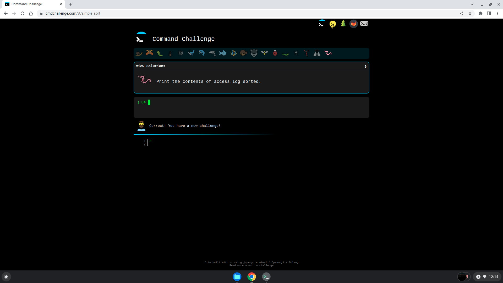
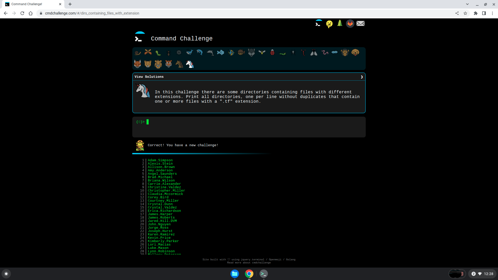

# command_line_for_the_win
## About Project
The project invloves taking 27 challenges about how to use the command line to perform actions in the terminal. The test are taken on [CMD Challenge Website](https://cmdchallenge.com/), an intuitive and awesome way to practice command line skills.

## Files & Directories
In the repository, the project is found in the [command_line_for_the_win](/command_line_for_the_win) directory with the following files;

* [0-first_9_tasks.jpg](./0-first_9_tasks.jpg) and [0-first_9_tasks.png](0-first_9_tasks.png): The screenshot files for the first 9 set of challenges 

* [1-next_9_tasks.jpg](./1-next_9_tasks.jpg) and [1-next_9_tasks.png](./1-next_9_tasks.png): The screenshot files for the second 9 set of challenges

* [2-next_9_tasks.jpg](./2-next_9_tasks.png) and [2-next_9_tasks.png](./2-next_9_tasks.png): The screenshot files for the last 9 set of challenges

## Steps Taken To Complete Project 
- Firstly, I entered my sandbox through the webterm and cloned the repository for my assignment and created the necessary directories and added my intial README file

- I then proceeded to complete the tasks and store my screenshots locally at:
/home/kowusubamfo/command_line_for_the_win

- Whilst in the same directory as my screenshot files, I established a STFP connection to the sandbox environment and used the `put` command to upload my screenshots.

	### How I Used STFP Command-line Tool
	* I copied the STFP command from sandbox of preference from my ALX dashboard sandboxes tab; pasted and run it on my local terminal and confirmed addition of the remote server by typing `yes`
	* The password was requested, which was also available for at the sandbox tab, which I copied and pasted; after which the STFP connection was established.
	* I navigated to the directory I was am to upload my screenshots and used the `put` command to upload the screenshots from my local directory to the sandbox environment.
  
- I then exited my STFP connection and entered my sandbox to confirm the successful upload and push the screenshots to GitHub.

- Lastly, I updated my README file with information on the files present and the steps taken to upload the screenshots.
